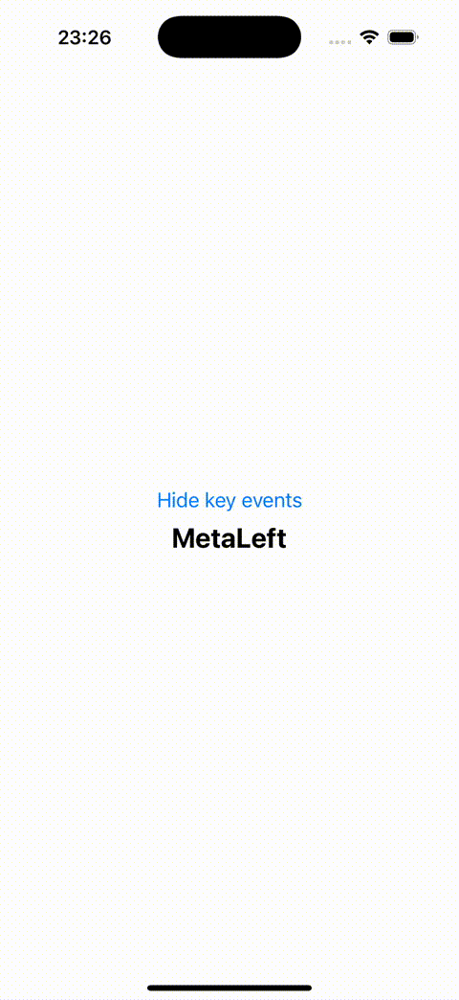
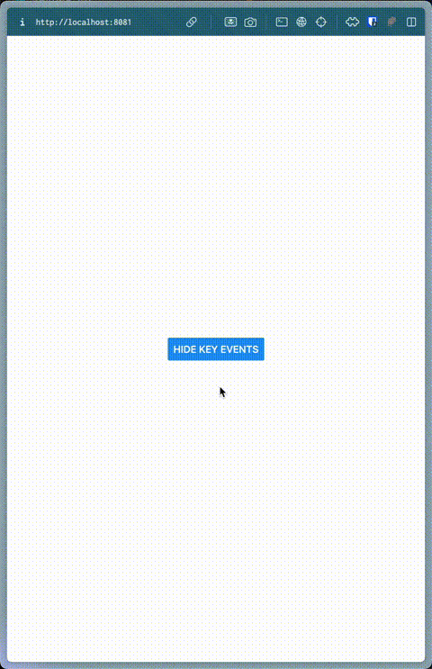
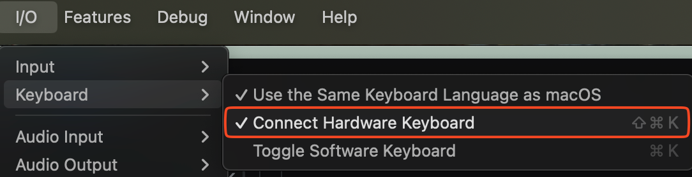

<div align="center">
  <h2 align="center">Expo-key-event</h2>

  <p align="center">
    Interface for reading key events from external devices such as Bluetooth keyboards/gamepads.
    <br />
    <a href="https://github.com/tlow92/expo-key-event?tab=readme-ov-file#getting-started">Getting started</a>
    &middot;
    <a href="https://github.com/tlow92/expo-key-event/issues/new">Report Bug</a>
  </p>
</div>

<br />
<br />

<div align="center">
  <table>
    <tr>
      <td align="center">
        <strong>iOS</strong><br/>
        <a href="https://github.com/user-attachments/assets/9bfc25cf-6b18-46f0-947e-3d982ed46fd5">
          
        </a>
      </td>
      <td align="center">
        <strong>Android</strong><br/>
        <a href="https://github.com/user-attachments/assets/b4a71bd3-6617-4ae6-98c0-60ba285c2143">
          
        </a>
      </td>
      <td align="center">
        <strong>Web</strong><br/>
        <a href="https://github.com/user-attachments/assets/469deda3-9254-4a66-b56f-bf79c7e20997">
          
        </a>
      </td>
    </tr>
  </table>

</div>


## Getting started

`npm i expo-key-event`


<br />

## Usage

Automatic listening: Key events are listened to as soon as `MyComponent` is mounted.

```tsx
import { useKeyEvent } from "expo-key-event";
import { Text } from "react-native";

export function MyComponent() {
  const { keyEvent } = useKeyEvent();

  return <Text>{keyEvent?.key}</Text>;
}
```


Manual listening: Key events are listened to when `startListening` is called.

```tsx
import { useKeyEvent } from "expo-key-event";
import { Text, View } from "react-native";

export function MyComponent() {
  const { keyEvent, startListening, stopListening } = useKeyEvent(false);

  return (
    <View>
      <Text>{keyEvent?.key}</Text>
      <Button title="Start listening" onPress={() => startListening()} />
      <Button title="Stop listening" onPress={() => stopListening()} />
    </View>
  );
}
```

<br />

## Run example app

`cd example`

`npm run ios` / `npm run android` / `npm run web`

<br />

## Troubleshooting

### Error: Cannot find native module 'ExpoKeyEvent'

Make sure to use a development build and not `Expo Go`.
See https://docs.expo.dev/guides/local-app-development/ for more details.

In short: Use `npx expo run:ios` instead of `npx expo start` (make sure bundleIdentifier is set in `app.json`).

### Key events are not registered in iOS simulator

Make sure that hardware keyboard is connected to the simulator.


### Key events are not registered in Android emulator

Since the Android emulator does not support USB or Bluetooth, you need to use a physical device so that key events can be registered.

Another option is to use `adb` to send key events to the emulator.

e.g. `adb shell input keyevent 10`

<br />

## How it works

This module translates the [Apple UIKit](https://developer.apple.com/documentation/uikit/uikeyboardhidusage) and [Android KeyEvent](https://developer.android.com/reference/android/view/KeyEvent) constants to a common set of key event types matching the ones from [Web](https://developer.mozilla.org/en-US/docs/Web/API/KeyboardEvent/code).


<br />

## Todo

- [ ] Implement modifier key combinations similar to [web](https://developer.mozilla.org/en-US/docs/Web/API/Element/keydown_event) like altKey, ctrlKey, metaKey, shiftKey
